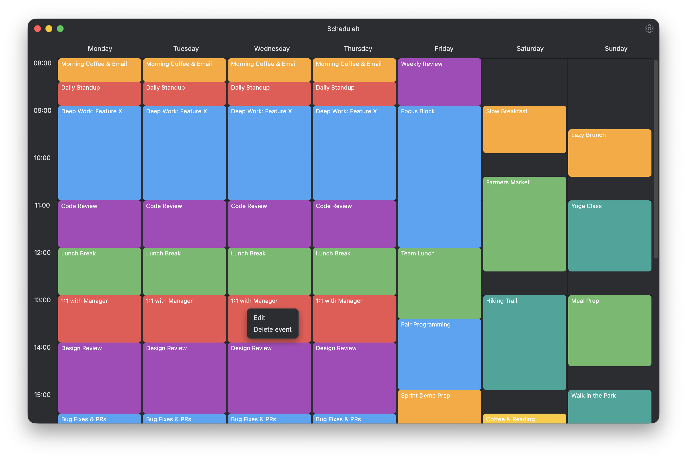
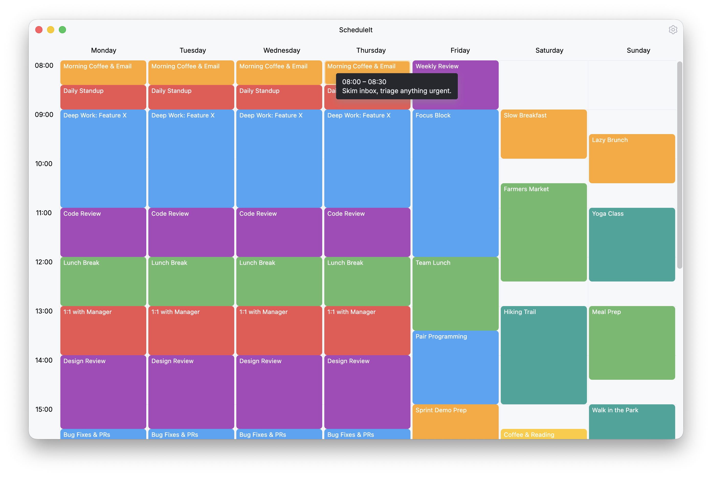
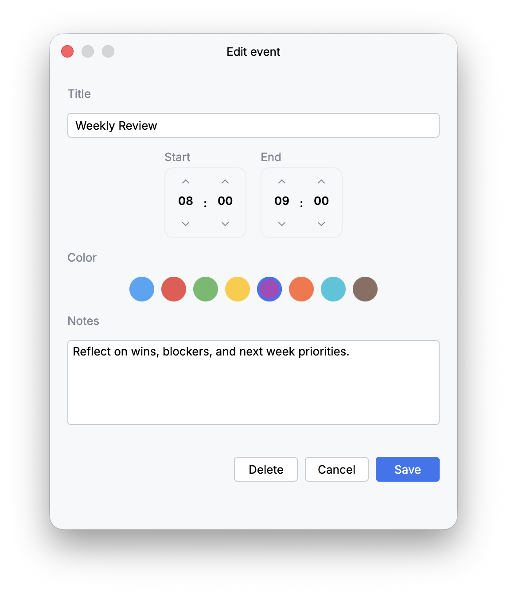
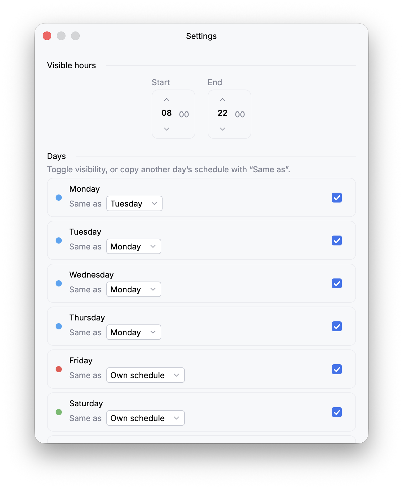

# ScheduleIt

A Kotlin Multiplatform app for designing your **recurring weekly schedule** — one template per weekday, color-coded events, notes, and notifications. Targets **Android, iOS, and Desktop (JVM)** with a shared Compose Multiplatform UI.

## Features

- **Weekly grid view** — Monday through Sunday at a glance, with a configurable visible hours window.
- **Day templates** — every weekday has its own schedule, or share one across days with "Same as".
- **Color-coded events** with title, time range, and free-form notes.
- **Hover tooltips** showing event details inline.
- **Native notifications** to remind you of upcoming events.
- **JSON import/export** for backup and migration between devices.
- **Single-instance** desktop app with native window decorations (Jewel + Nucleus).

## Screenshots

**Hover tooltips** show an event’s time and notes inline:

**Edit dialog** for changing title, time, color, and notes:

**Settings** to configure visible hours and per-day templates:

## License

This project is licensed under the GNU General Public License v3.0 — see the [LICENSE](./LICENSE) file for details.
